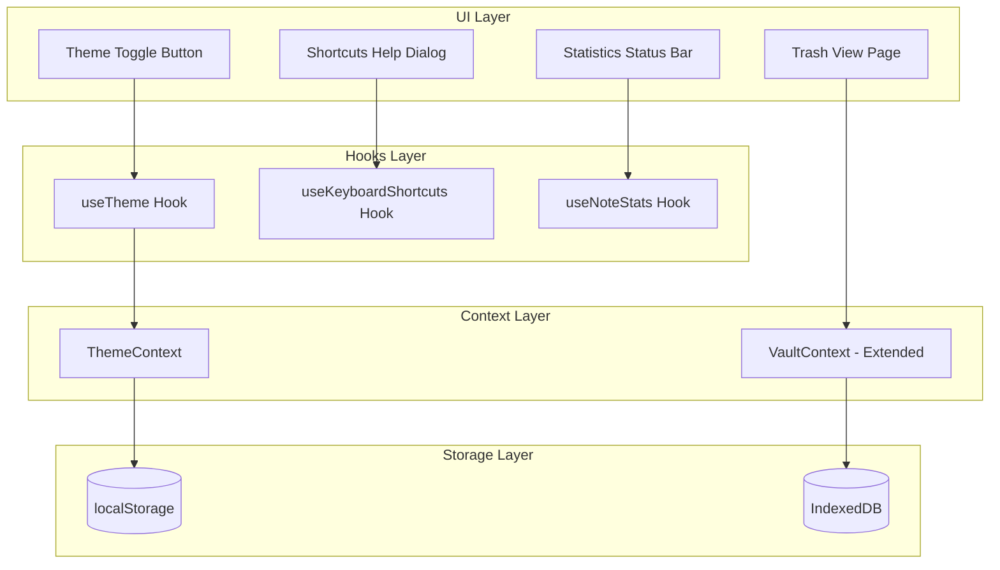

# Design Document: Enhanced UX Features

## Overview

This document describes the technical design for four enhanced user experience features in VaultNotes:

1. **Dark/Light Theme Toggle** - System-aware theme switching with persistence
2. **Keyboard Shortcuts** - Power user shortcuts for navigation and actions
3. **Trash/Recycle Bin** - Soft delete with restore capability
4. **Note Statistics** - Real-time word count, character count, and reading time

The design leverages existing patterns in the codebase: React Context for state management, localStorage for preferences, and IndexedDB for encrypted data storage.

## Architecture



## Components and Interfaces

### 1. Theme System

#### ThemeContext

```typescript
// src/contexts/ThemeContext.tsx

type Theme = 'light' | 'dark' | 'system';
type ResolvedTheme = 'light' | 'dark';

interface ThemeContextType {
  theme: Theme;
  resolvedTheme: ResolvedTheme;
  setTheme: (theme: Theme) => void;
}
```

#### ThemeToggle Component

```typescript
// src/components/ThemeToggle.tsx

interface ThemeToggleProps {
  className?: string;
}

// Renders a button that cycles through: light → dark → system
// Uses Sun/Moon/Monitor icons from lucide-react
```

### 2. Keyboard Shortcuts System

#### useKeyboardShortcuts Hook

```typescript
// src/hooks/use-keyboard-shortcuts.ts

interface Shortcut {
  key: string;
  modifiers: ('ctrl' | 'meta' | 'shift' | 'alt')[];
  action: () => void;
  description: string;
  scope: 'global' | 'editor';
}

interface UseKeyboardShortcutsOptions {
  shortcuts: Shortcut[];
  enabled?: boolean;
}

function useKeyboardShortcuts(options: UseKeyboardShortcutsOptions): void;
```

#### ShortcutsHelpDialog Component

```typescript
// src/components/ShortcutsHelpDialog.tsx

interface ShortcutsHelpDialogProps {
  open: boolean;
  onOpenChange: (open: boolean) => void;
}

// Displays all available shortcuts grouped by scope
```

### 3. Trash System

#### Extended Storage Interface

```typescript
// src/lib/storage.ts (extended)

interface TrashedNote extends Note {
  deletedAt: number;
}

// New functions
async function moveToTrash(noteId: string): Promise<void>;
async function getTrashedNotes(vaultId: string): Promise<TrashedNote[]>;
async function restoreFromTrash(noteId: string): Promise<void>;
async function permanentlyDelete(noteId: string): Promise<void>;
async function emptyTrash(vaultId: string): Promise<void>;
```

#### Extended VaultContext

```typescript
// src/contexts/VaultContext.tsx (extended)

interface VaultContextType {
  // ... existing properties
  trashedNotes: DecryptedTrashedNote[];
  moveToTrash: (noteId: string) => Promise<void>;
  restoreNote: (noteId: string) => Promise<void>;
  permanentlyDeleteNote: (noteId: string) => Promise<void>;
  emptyTrash: () => Promise<void>;
}

interface DecryptedTrashedNote extends DecryptedNote {
  deletedAt: number;
}
```

### 4. Note Statistics System

#### useNoteStats Hook

```typescript
// src/hooks/use-note-stats.ts

interface NoteStats {
  wordCount: number;
  characterCount: number;
  characterCountNoSpaces: number;
  lineCount: number;
  paragraphCount: number;
  readingTimeMinutes: number;
}

function useNoteStats(content: string): NoteStats;
```

#### NoteStatsBar Component

```typescript
// src/components/NoteStatsBar.tsx

interface NoteStatsBarProps {
  stats: NoteStats;
  className?: string;
}

// Renders a compact status bar with key statistics
```

## Data Models

### Theme Preference Storage

```typescript
// localStorage key: 'vaultnotes-theme'
// Value: 'light' | 'dark' | 'system'
```

### Trashed Note Schema

The existing IndexedDB schema will be extended with a new object store:

```typescript
// IndexedDB store: 'trashedNotes'
interface TrashedNoteRecord {
  id: string;
  vaultId: string;
  encryptedContent: string;
  createdAt: number;
  updatedAt: number;
  deletedAt: number;  // New field
}
```

Database migration will increment DB_VERSION and create the new store.

### Keyboard Shortcuts Registry

```typescript
const SHORTCUTS_REGISTRY: Shortcut[] = [
  // Global shortcuts
  { key: 'n', modifiers: ['ctrl'], action: createNote, description: 'Create new note', scope: 'global' },
  { key: 'k', modifiers: ['ctrl'], action: openSearch, description: 'Open search', scope: 'global' },
  { key: ',', modifiers: ['ctrl'], action: openSettings, description: 'Open settings', scope: 'global' },
  { key: 'Escape', modifiers: [], action: closeDialog, description: 'Close dialog', scope: 'global' },
  { key: '/', modifiers: ['ctrl'], action: showHelp, description: 'Show shortcuts', scope: 'global' },
  
  // Editor shortcuts
  { key: 's', modifiers: ['ctrl'], action: saveNote, description: 'Save note', scope: 'editor' },
  { key: 'Backspace', modifiers: ['ctrl'], action: deleteNote, description: 'Move to trash', scope: 'editor' },
];
```

## Correctness Properties

*A property is a characteristic or behavior that should hold true across all valid executions of a system—essentially, a formal statement about what the system should do. Properties serve as the bridge between human-readable specifications and machine-verifiable correctness guarantees.*

### Property 1: Theme Persistence Round-Trip

*For any* theme value ('light', 'dark', or 'system'), saving the theme to localStorage and then loading it should return the same theme value.

**Validates: Requirements 1.3, 1.4**

### Property 2: Theme Toggle State Transition

*For any* current theme state, clicking the theme toggle should transition to the next state in the cycle: light → dark → system → light.

**Validates: Requirements 1.2**

### Property 3: Shortcut Action Triggering

*For any* registered shortcut and matching key event, the shortcut's action should be invoked exactly once.

**Validates: Requirements 2.1, 2.2**

### Property 4: Shortcut Default Prevention

*For any* registered shortcut key combination, the browser's default behavior should be prevented when the shortcut is triggered.

**Validates: Requirements 2.4**

### Property 5: Platform-Aware Modifier Keys

*For any* shortcut using 'ctrl' modifier, on macOS the shortcut should respond to Cmd key, and on other platforms it should respond to Ctrl key.

**Validates: Requirements 2.6**

### Property 6: Trash Soft-Delete Invariant

*For any* note that is deleted, the note should appear in the trashed notes list and not in the active notes list, with a valid deletedAt timestamp.

**Validates: Requirements 3.1, 3.2**

### Property 7: Trash Restore Round-Trip

*For any* note that is moved to trash and then restored, the note should return to the active notes list with its original createdAt and updatedAt timestamps preserved.

**Validates: Requirements 3.5, 3.8**

### Property 8: Trash Permanent Delete

*For any* trashed note that is permanently deleted, the note should not exist in either the active notes list or the trashed notes list.

**Validates: Requirements 3.6, 3.7**

### Property 9: Statistics Calculation Correctness

*For any* non-empty string content, the calculated statistics should satisfy:
- wordCount equals the number of whitespace-separated tokens
- characterCount equals content.length
- characterCountNoSpaces equals content without spaces length
- lineCount equals the number of newline characters plus one
- paragraphCount equals the number of double-newline separated blocks

**Validates: Requirements 4.1, 4.2**

### Property 10: Reading Time Calculation

*For any* word count, the reading time in minutes should equal Math.ceil(wordCount / 200).

**Validates: Requirements 4.5**

### Property 11: Aggregate Statistics Correctness

*For any* collection of notes, the aggregate word count should equal the sum of individual note word counts.

**Validates: Requirements 4.6**

## Error Handling

### Theme System
- If localStorage is unavailable, fall back to system preference
- If system preference detection fails, default to 'light' theme

### Keyboard Shortcuts
- Shortcuts should not fire when user is typing in input fields (except editor-specific shortcuts)
- Invalid key combinations should be silently ignored

### Trash System
- If a note fails to move to trash, show error toast and keep note in active list
- If restore fails, show error toast and keep note in trash
- Permanent delete should confirm with user before proceeding

### Statistics
- Empty content should return all zeros
- Invalid content (null/undefined) should be treated as empty

## Testing Strategy

### Unit Tests

Unit tests will cover specific examples and edge cases:

1. **Theme System**
   - Theme toggle cycles correctly
   - System preference detection works
   - localStorage persistence works

2. **Keyboard Shortcuts**
   - Modifier key detection on different platforms
   - Shortcut matching logic
   - Scope filtering (global vs editor)

3. **Trash System**
   - Move to trash adds deletedAt timestamp
   - Restore preserves original timestamps
   - Empty trash removes all trashed notes

4. **Statistics**
   - Empty string returns zeros
   - Single word content
   - Multi-paragraph content
   - Content with special characters

### Property-Based Tests

Property-based tests will use **fast-check** library for TypeScript/JavaScript. Each test will run minimum 100 iterations.

1. **Theme persistence round-trip** - Generate random theme values, save and load
2. **Statistics calculation** - Generate random strings, verify calculation formulas
3. **Trash operations** - Generate random notes, verify soft-delete and restore invariants

Test files will be co-located with source files using `.test.ts` suffix.

Each property test will be tagged with:
```typescript
// Feature: enhanced-ux-features, Property N: [property description]
```
